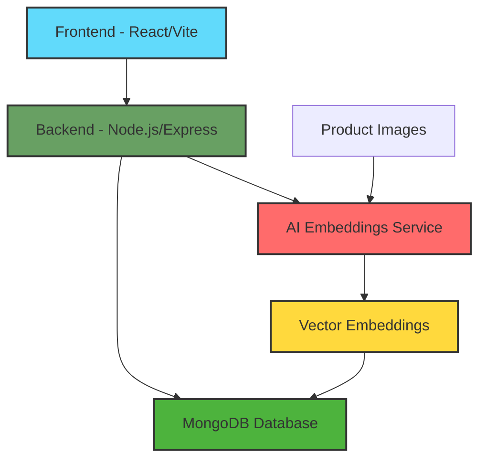

# � Unthinkable Vision - AI Visual Search

<div align="center">
  
  
  
  
  
  
</div>

<div align="center">
  <h3>✨ Discover Visually Similar Products Using AI ✨</h3>
  <p>A cutting-edge visual search engine that uses deep learning to find similar products based on image input.</p>
</div>

## � System Architecture



## 📝 Project Overview

UnthinkableVision is an innovative fashion search platform that combines cutting-edge AI technology with an intuitive user interface. The system processes fashion product images through deep learning models to generate vector embeddings, enabling sophisticated similarity-based search capabilities.

### Key Components

#### Frontend Architecture
- React 18 with Vite for optimal performance
- Space-themed split-screen interface with animated elements
- Real-time search results with dynamic filtering
- Responsive design using Tailwind CSS
- Cloudinary integration for image optimization

#### Backend Infrastructure
- Node.js/Express server with RESTful API endpoints
- MongoDB for scalable product and metadata storage
- Python-based AI service for generating embeddings
- Vector similarity search implementation
- Efficient data processing pipeline

### Data Flow
1. Product images are processed through AI models to generate embeddings
2. Embeddings and metadata are stored in MongoDB
3. Users can search through visual or text-based queries
4. Backend processes queries and returns relevant matches
5. Results are displayed in an intuitive card-based layout

## �🚀 Features

- 🔍 **Visual Similarity Search**: Advanced neural network for precise product matching
- 🖼️ **Flexible Input**: Upload images directly or paste image URLs
- 🎯 **Smart Filtering**: Filter by gender, color, category, and similarity score
- 📊 **Real-time Analysis**: Instant similarity scoring and matching
- 🌓 **Dark Mode**: Space-themed dark mode interface
- 💫 **Smooth Animations**: Fluid transitions and micro-interactions
- 🎨 **Modern UI**: Sleek space-themed design with glowing effects
- ☁️ **Cloudinary Integration**: Optimized image handling and processing

## 🛠️ Tech Stack

### Frontend
- **React 18** with Vite for blazing fast development
- **TailwindCSS** for modern, responsive styling
- **Framer Motion** for smooth animations
- **Axios** for API communication
- **Cloudinary SDK** for image optimization

### Backend
- **Node.js** & Express for robust server
- **MongoDB** for scalable database
- **TensorFlow** for image feature extraction
- **Python** scripts for ML processing
- **Cloudinary** for image management

## 🚀 Deployment

### Deploying Frontend to Vercel

1. **Prepare Your Repository**
   ```bash
   # Ensure your frontend directory is committed to GitHub
   git add .
   git commit -m "Prepare for Vercel deployment"
   git push
   ```

2. **Deploy to Vercel**
   - Sign up/Login at [Vercel](https://vercel.com)
   - Click "New Project"
   - Import your GitHub repository
   - Select the `frontend` directory as the root
   - Set build settings:
     - Framework Preset: `Vite`
     - Build Command: `npm run build`
     - Output Directory: `dist`
     - Install Command: `npm install`

3. **Configure Environment Variables**
   - Go to Project Settings > Environment Variables
   - Add the following:
     ```
     VITE_BACKEND_URL=your_backend_url
     VITE_CLOUDINARY_CLOUD_NAME=your_cloud_name
     VITE_CLOUDINARY_UPLOAD_PRESET=your_preset
     ```

4. **Deploy**
   - Click "Deploy"
   - Vercel will automatically build and deploy your frontend
   - You'll get a production URL like `your-app.vercel.app`

5. **Custom Domain (Optional)**
   - Go to Project Settings > Domains
   - Add your custom domain
   - Follow Vercel's DNS configuration instructions

### Auto-Deployments
- Vercel will automatically deploy when you push to your main branch
- Preview deployments are created for pull requests
- You can configure deployment settings in `vercel.json`

## 🏃‍♂️ Getting Started

### Prerequisites
- Node.js (v16 or higher)
- Python 3.8+
- MongoDB
- npm or yarn

### Setting Up Frontend
\`\`\`bash
# Navigate to frontend
cd frontend

# Install dependencies
npm install

# Create .env file
cp .env.example .env

# Start development server
npm run dev
\`\`\`

### Setting Up Backend
\`\`\`bash
# Navigate to backend
cd backend

# Install Node.js dependencies
npm install

# Install Python requirements
pip install -r requirements.txt

# Configure environment
cp .env.example .env

# Start server
npm start
\`\`\`

## ⚙️ Environment Configuration

### Frontend (.env)
\`\`\`env
VITE_BACKEND_URL=http://localhost:5000
VITE_CLOUDINARY_CLOUD_NAME=your_cloud_name
VITE_CLOUDINARY_UPLOAD_PRESET=your_preset
\`\`\`

### Backend (.env)
\`\`\`env
MONGODB_URI=your_mongodb_uri
PORT=5000
CLOUDINARY_CLOUD_NAME=your_cloud_name
CLOUDINARY_API_KEY=your_api_key
CLOUDINARY_API_SECRET=your_api_secret
\`\`\`


## 🗄️ Project Structure

\`\`\`
unthinkable-vision/
├── frontend/                # React frontend
│   ├── src/
│   │   ├── components/     # React components
│   │   ├── utils/         # Utility functions
│   │   ├── App.jsx        # Main application
│   │   └── main.jsx       # Entry point
│   └── index.html         # HTML template
├── backend/                # Node.js backend
│   ├── controllers/       # Route controllers
│   ├── models/           # MongoDB models
│   ├── routes/           # API routes
│   ├── utils/            # Helper utilities
│   │   ├── embeddings.js  # Feature extraction
│   │   └── generate_embed.py # Python ML script
│   └── index.js          # Server entry
└── data/                  # Data files
    └── raw/              # Raw datasets
\`\`\`


### Product Search
\`\`\`http
POST /api/products/search
# Body: FormData (image file or URL)
# Returns: Array of similar products with scores
\`\`\`

### Product Management
\`\`\`http
GET /api/products        # Get all products
POST /api/products       # Add new product
PUT /api/products/:id    # Update product
DELETE /api/products/:id # Delete product
\`\`\`

## 🧠 Machine Learning

The visual search employs a sophisticated neural network architecture:

- **Model**: Pre-trained ResNet50
- **Feature Vector**: 2048-dimensional
- **Similarity**: Cosine similarity metric
- **Processing**: Real-time feature extraction
- **Input Processing**: Automatic resizing and normalization

## 🎨 Key Components

- **Dropzone**: Space-themed upload area with animations
- **FilterPanel**: Advanced filtering with real-time updates
- **ResultCard**: Product cards with similarity scores
- **Navbar**: Navigation with theme switching

## 🤝 Contributing

1. Fork the repository
2. Create feature branch (`git checkout -b feature/AmazingFeature`)
3. Commit changes (`git commit -m 'Add AmazingFeature'`)
4. Push to branch (`git push origin feature/AmazingFeature`)
5. Open a Pull Request

## 📝 License

Distributed under the MIT License. See `LICENSE` for more information.

## 👥 Team

- **Developer**: Anil Jangid

## 🌟 Acknowledgements

- TensorFlow team for ML tools
- React team for the framework
- Cloudinary for image services
- MongoDB team for the database

